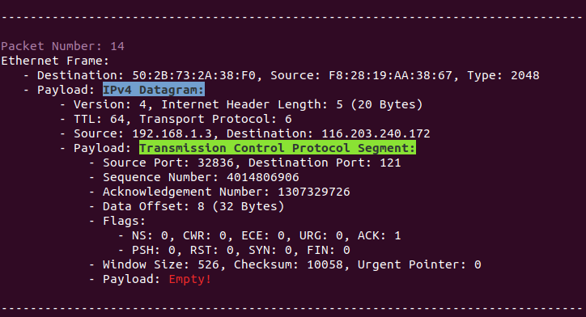

# PacketSniffer

A Python-based Packet Sniffer

This simple python script can capture packets on a local network and is capable of unpacking popular protocols. This Script Also saves all data in a .pcap file.
## Usage
```bash
sudo python3 PcktSniffer_main.py
```
Note that you have to enable "‫‪promiscuous‬‬" mode in order to tell your network card to also process the packets that aren't for your device.
```bash
sudo ifconfig [interface] promisc #Enables promiscous mode
sudo ifconfig [interface] -promisc #Disables promiscous mode
```
## Screenshot
